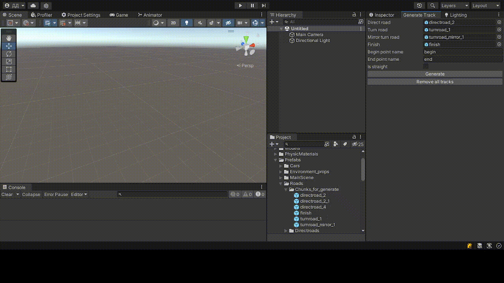

<h1 align="center">Racing</h1>
<h1 align="center">

[Racing Demo (installer on windows)](https://drive.google.com/drive/folders/11N0Sd8-jbeBE95ZjCSP_VtCqtva2yTuR?usp=sharing)

</h1>

# Содержание
* [Описание](#описание)
    * [Как играть](#как-играть)
* [Реализация](#реализация)
    * [Менеджеры](#менеджеры)
    * [Система событий](#система-событий)
    * [Контейнеры данных](#контейнеры-данных)
* [Особенности](#особенности)
    * [Генерация дороги](#генерация-дороги)
* [Использованные ассеты](#использованные-ассеты)

# Описание
Демонстрационный проект на Unity (v.2021.3.6f1), в котором вы можете выбрать один из трёх автомобилей и перемещаться на нём по сгенерированной трассе.

## Как играть
Управляйте автомобилем с помощью клавиш WASD. Также, в окне настроек игры, вы можете выбрать клавиши для включения передних фар и для торможения. 

Нажатие на клавишу F выводит консоль в левом верхнем углу с отображением текущей частоты кадров (только в игровом режиме).

# Реализация
## Менеджеры
[GameManager](Assets/Scripts/Managers/GameManager.cs) - основной менеджер, отвечающий за управление другими менеджерами, настройками игры и её состоянием (выход из игры, пауза).

[UIManager](Assets/Scripts/Managers/UIManager.cs) обеспечивает взаимодействие элементов пользовательского интерфейса.
## Система событий
Подписка на события, отписка от них и их вызов реализован с помощью [широковещательной рассылки сообщений](Assets/Scripts/Broadcast%20messages/BroadcastMesssages.cs), используемой также в моём [предыдущем проекте](https://github.com/DIDenis/Runner).
## Контейнеры данных
С помощью ScriptableObject я реализовал [контейнеры данных](Assets/Scripts/Main%20scene%20scripts/CarData.cs) для автомобилей, используемых в проекте. Данные затем выводятся при нажатии клавиши Info в окне выбора автомобиля.

 

# Особенности
## Генерация дороги
Дорога генерируется из заранее готовых чанков ("прямых" чанков и чанков с поворотами) случайным образом. Помимо этого, в редакторе Unity есть возможность, не входя в play mode, сгенерировать дорогу прямо в сцене.

[Окно генерации](Assets/Scripts/Editor/GenerateTrackWindow.cs) находится в Window > Generate track

# Использованные ассеты
* Автомобили - [раз](https://assetstore.unity.com/packages/3d/vehicles/land/low-poly-sports-car-20-144253), [два](https://assetstore.unity.com/packages/3d/vehicles/land/low-poly-civilian-vehicle-5-124987), [три](https://assetstore.unity.com/packages/3d/vehicles/land/realistic-mobile-car-demo-173467).
* [Дорожные элементы](https://assetstore.unity.com/packages/3d/props/simple-street-props-194706), [заборы](https://assetstore.unity.com/packages/3d/chainlink-fences-73107)
* [Модульная система дорог](https://assetstore.unity.com/packages/3d/environments/urban/modular-lowpoly-streets-free-192094)
* [UI](https://assetstore.unity.com/packages/2d/gui/icons/simple-button-set-02-184903)